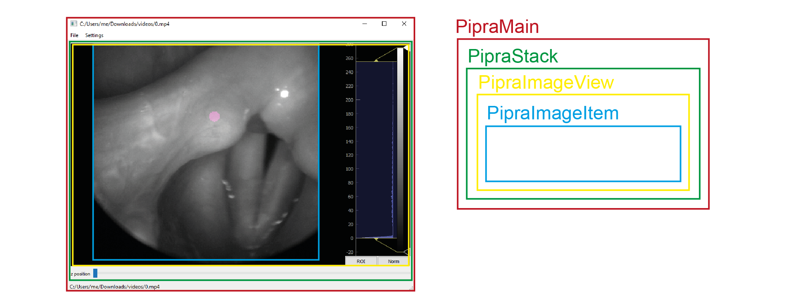
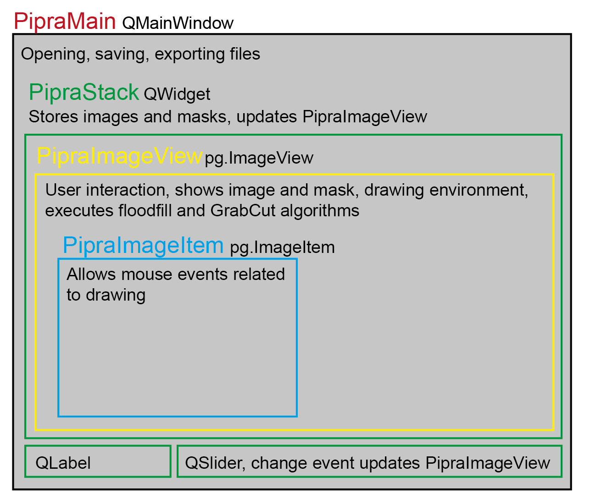

Welcome to pipra's documentation!
=================================

.. image:: images/pipra.png
    :align: center
    :alt: pipra logo

`pipra` is a smart tool for binary mask generation.
It stores annotated mask in `.mask` files, which are basically HDF5 container that can be read easily with various tools, such
as h5py, flammkuchen or MATLAB. 

pipra's structure
-----------------

`pipra` is written in PyQt5 and uses `pyqtgraph <https://www.pyqtgraph.org/>`_ to show and interact with images. The following image
provides an overview how the different classes inside `pipra` are arranged.

``pipra`` relies on QMainWindow to open, save and export files, and interact with the menu bar and the status bar. The ``PipraStack`` is a 
``QWidget`` that stores the image stack and the corresponding masks. It contains the slider to change the shown image and respective
mask in the ``PipraImageView``. To allow custom mouse events, such as drawing without moving the image or wheel-based image change,
``PipraImageItem`` is introduced.

pipra's modules
---------------

.. automodule:: pipra.pipra
    :members:

floodfill
---------    

.. automodule:: pipra.floodfill
    :members:

grabcut
-------

.. automodule:: pipra.grabcut
    :members:

.. toctree::
   :maxdepth: 2
   :caption: Contents:

Indices and tables
==================

* :ref:`genindex`
* :ref:`modindex`
* :ref:`search`
