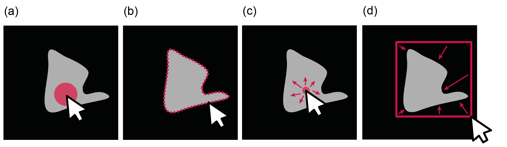

# Summary

Semantic segmentation is a key task in Deep Learning, where each pixel of 
a given image is assigned to a class, e.g. fore- and background. Supervised training of deep 
neural networks requires ground-truth data,
such as a binary mask stating fore- and background. As large amounts of
data are needed and the ground-truth data is commonly manually annotated, efficient tools are crucial. Here, we provide `pipra`,
a smart tool for generating efficiently binary masks using four different modes of 
annotation. 

# Statement of need

Predicting binary masks is a common task in modern deep learning. There are plenty
of tools that allow the annotation, such as [LabelMe](https://github.com/wkentaro/labelme) [@labelme2016] and [DiffGram](https://github.com/diffgram/diffgram).
However, many of these tools are focusing on annotation completeness and
are not optimized to a specific problem, such as the fast generation of binary masks
of large, continuous files, such as videos. They further use adjustable polygonal structures, whereas `pipra` directly annotates single pixels.

With `pipra`, we focus on the efficient generation of binary masks with 
maximum interoperability. We also ensure a low threshold to use the software,
as the major userbase is not necessarily a programming expert. In detail, pipra is easy to install from an Anaconda
environment (`pip install pipra`) and can be simply executed with the command `pipra`. We further offer a pre-compiled version on [anki.xyz/pipra](https://www.anki.xyz/pipra) using [fbs](https://build-system.fman.io/).

`pipra` consists of a graphical user interface (GUI) written in Python 3.6+ and is based
on the libraries PyQt5 and pyqtgraph. For fast operations, we rely on numpy arrays [@harris:2020] and
utilize LLVM compiled functions using `numba` [@lam:2015] to further accelerate the annotation
using variants of flood filling algorithms. For more complex  foreground annotations, `pipra` utilizes the GrabCut algorithm that has been shown very useful in various scenarios [@rother2004grabcut], by allowing the user to draw an initialization rectangle that is refined by the algorithm. 

In summary, `pipra` allows the annotation using four major modalities (Figure \ref{fig:modalities}) to foster
high annotation speeds:

  - Brush (painting tool)
  - Outline (fills the inside of a drawn, polygonal outline)
  - Floodfill (grows an area relative to a seed pixel with termination condition)
  - GrabCut (iteratively refines an area to separate fore- from background using graph cuts)

In general, `pipra` is intended for time variant data, such as videos, or z-stacks, such as
microscopy stacks at different positions in `z`. In addition, `pipra` also provides a folder mode
to label efficiently multiple images in a given folder without individual loading and saving.
The resulting segmentation masks are stored as `hdf5` container to offer maximum flexibility,
but can be easily exported from the graphical user interface to `tif` and `mp4` files.

`pipra` has been already successfully applied in several biomedical image segmentation tasks to allow
the segmentation of the glottal area in high-speed videoendoscopy footage [@gomez:2020;@kist:2021]
or the segmentation of cerebellar Purkinje cells in confocal stacks [@markov:2020]. Currently, it is used to label dendritic spines and vocal folds (unpublished data).

# Acknowledgements

We acknowledge contributions from Pablo Gómez and Martin Fernholz for constructive feedback to improve `pipra`. We thank Luigi Petrucco, Luisa Neubig and Tom Schöneck for comments on the manuscript.

# References

